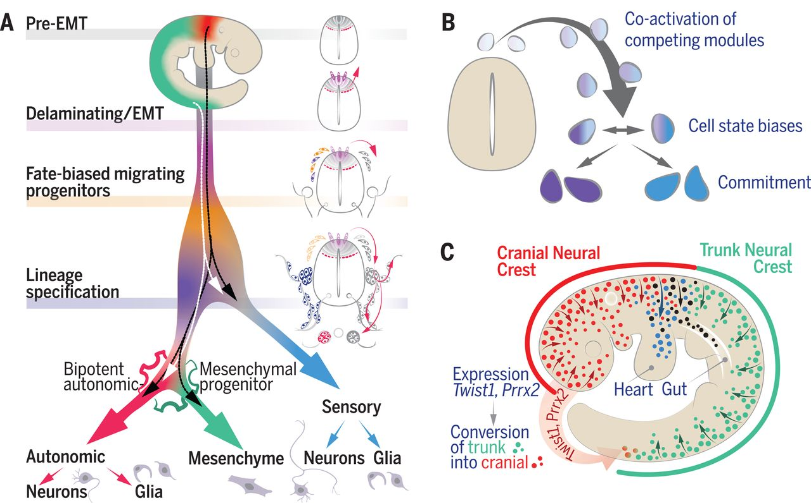

# Spatiotemporal structure of cell fate decisions in murine neural crest (study)

This repository is an study over the Spatial Transcriptomics data of developmental neural crest.

> The code is written primarily in Python and was supported by Claude/Opus 5.  
> There are a few CLIs in R and Bash.  

[DOI: https://doi.org/10.1038/s41588-025-02352-6](https://www.science.org/doi/10.1126/science.aas9536?referrer=https%3A%2F%2Fwww.google.com%2F)

Abstract (paper):

Neural crest cells are embryonic progenitors that generate numerous cell types in vertebrates. With single-cell analysis, we show that mouse trunk neural crest cells become biased toward neuronal lineages when they delaminate from the neural tube, whereas cranial neural crest cells acquire ectomesenchyme potential dependent on activation of the transcription factor Twist1. The choices that neural crest cells make to become sensory, glial, autonomic, or mesenchymal cells can be formalized as a series of sequential binary decisions. Each branch of the decision tree involves initial coactivation of bipotential properties followed by gradual shifts toward commitment. Competing fate programs are coactivated before cells acquire fate-specific phenotypic traits. Determination of a specific fate is achieved by increased synchronization of relevant programs and concurrent repression of competing fate programs.

## Source and Data

- Data and materials availability: 

All single-cell RNA-seq datasets have been deposited in the GEO under accession code GSE129114. Processed data, code, supplementary materials, and interactive views of datasets can be accessed on the authors’ website: http://pklab.med.harvard.edu/ruslan/neural.crest.html.

## Cell types

- xxxxx

## Papers

1. xxxxxxxxxxxxx

### Install uv with R

 - project: neural-crest
 - R:
   - conda activate renv 
   - (renv) (neural-crest)$ uv pip instal rpy2

## Citation

Soldatov R, Kaucka M, Kastriti ME, Petersen J, Chontorotzea T, Englmaier L, Akkuratova N, Yang Y, Häring M, Dyachuk V, Bock C, Farlik M, Piacentino ML, Boismoreau F, Hilscher MM, Yokota C, Qian X, Nilsson M, Bronner ME, Croci L, Hsiao WY, Guertin DA, Brunet JF, Consalez GG, Ernfors P, Fried K, Kharchenko PV, Adameyko I. Spatiotemporal structure of cell fate decisions in murine neural crest. Science. 2019 Jun 7;364(6444):eaas9536. doi: 10.1126/science.aas9536. PMID: 31171666.
